[TOC]
## Dust 测试平台

### 简介

Dust主要是本人的练手写的，用来辅助测试，优化集成和一些单独的小功能。主要使用的是python + flask完成的。
前端的模板要是主要使用的AdminLTE的基础样式，在里面集成了动态图表功能，测试报告的样式使用的是改进后的htmlrunner。

### 效果图

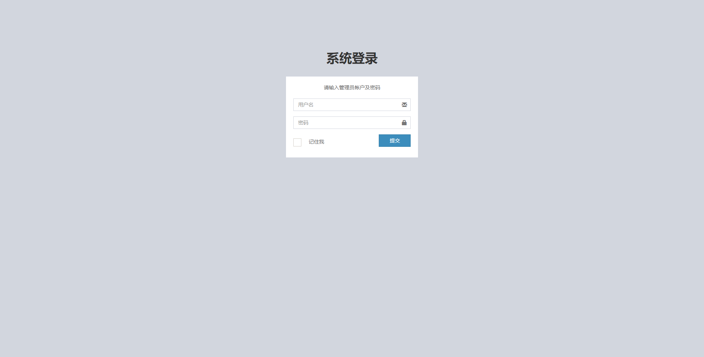
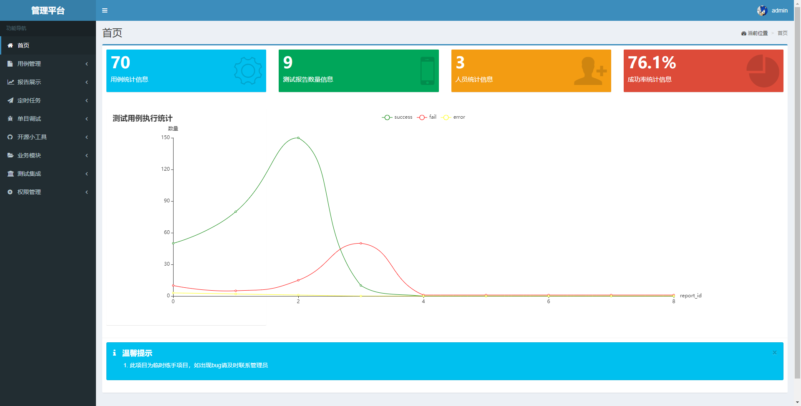

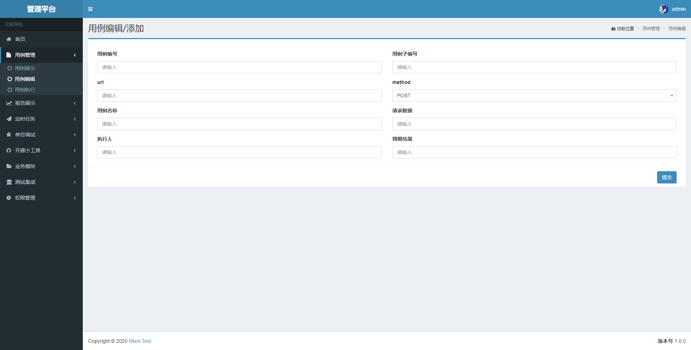
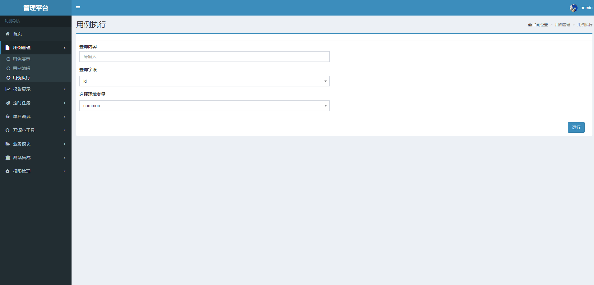
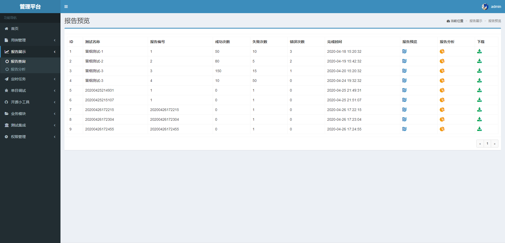
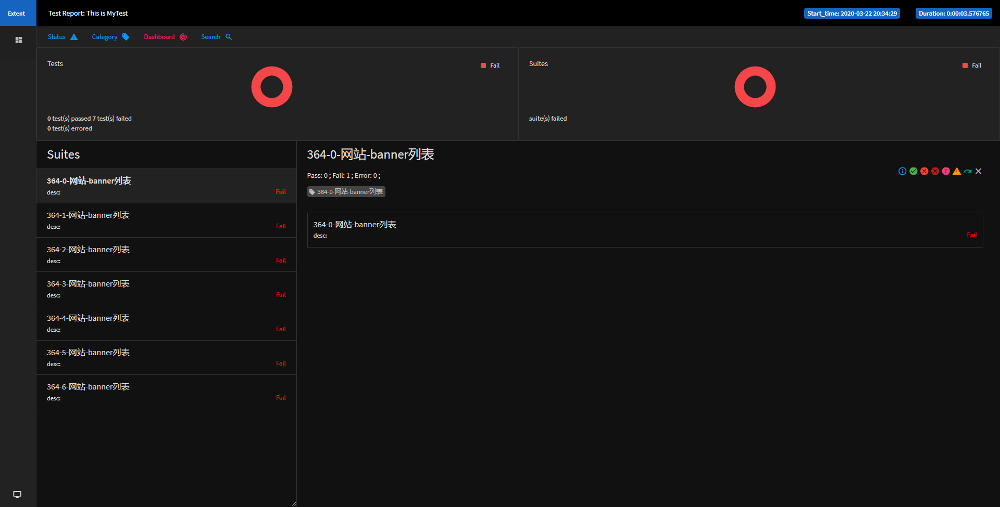
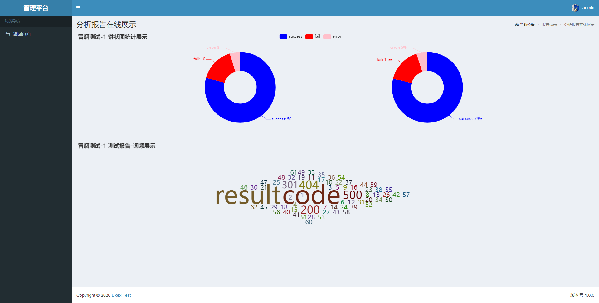
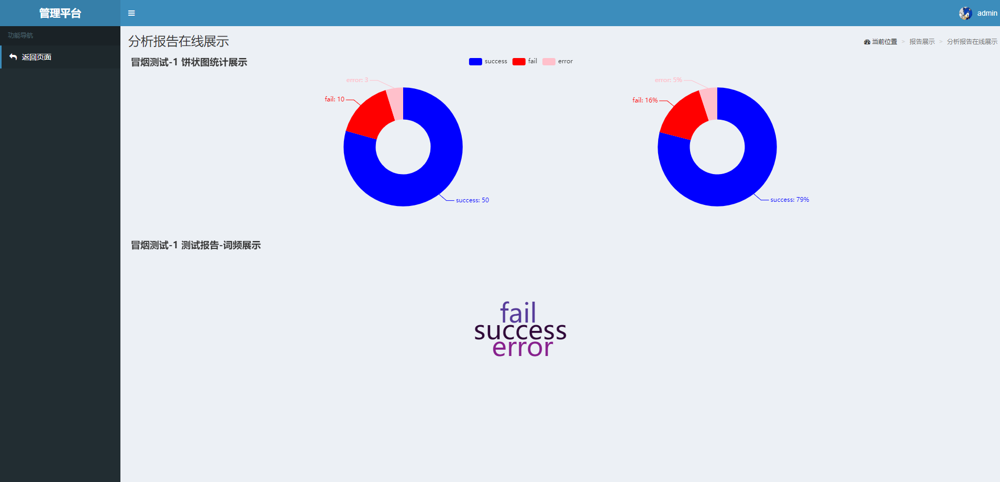
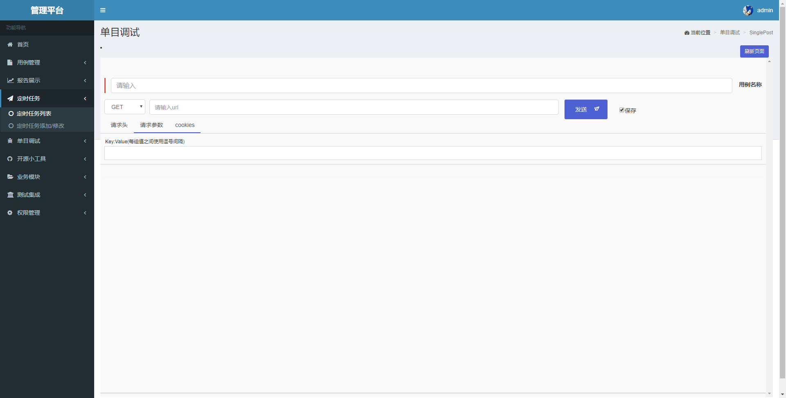
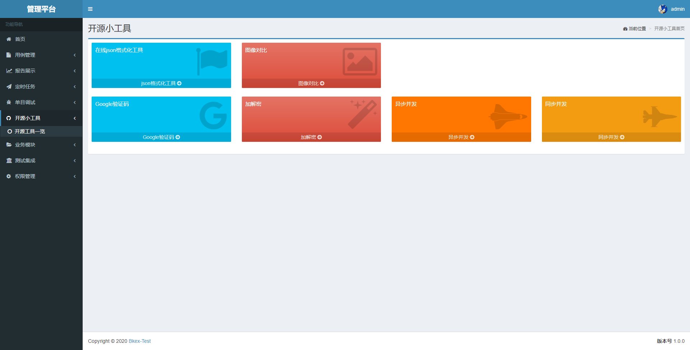
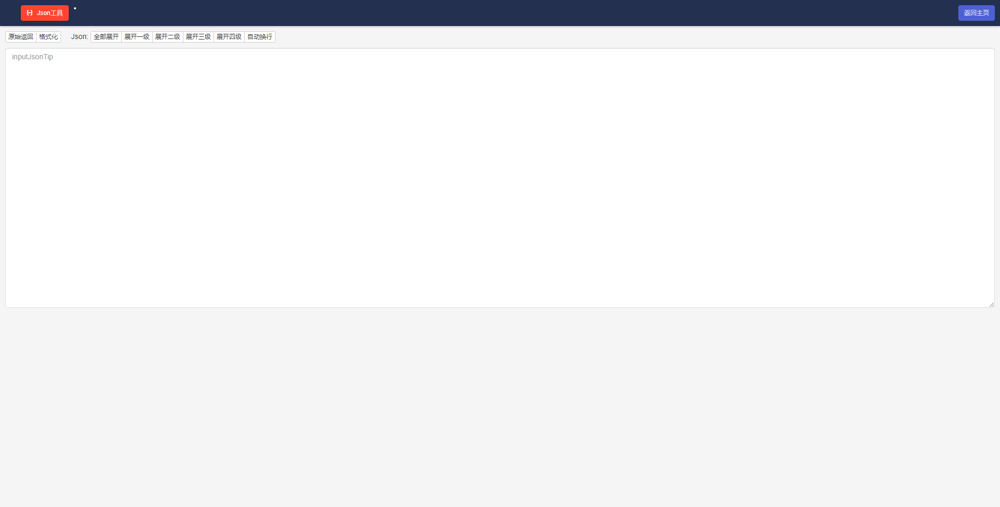
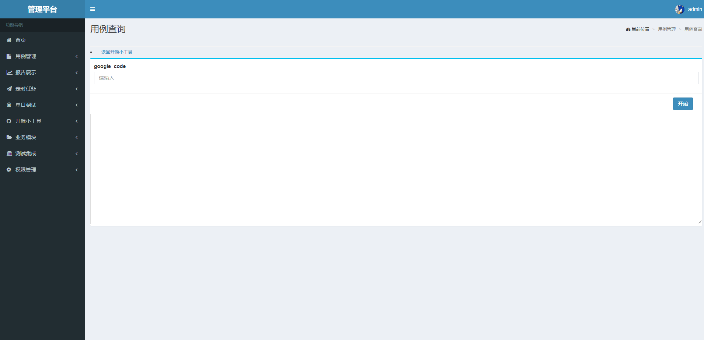
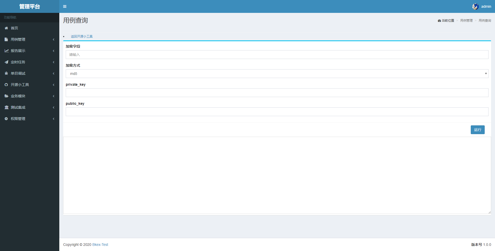
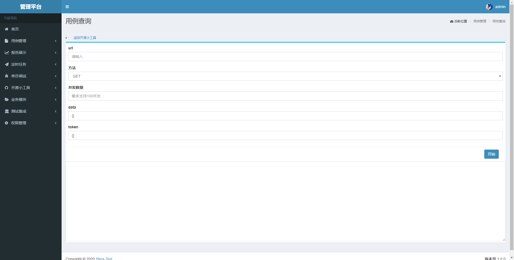

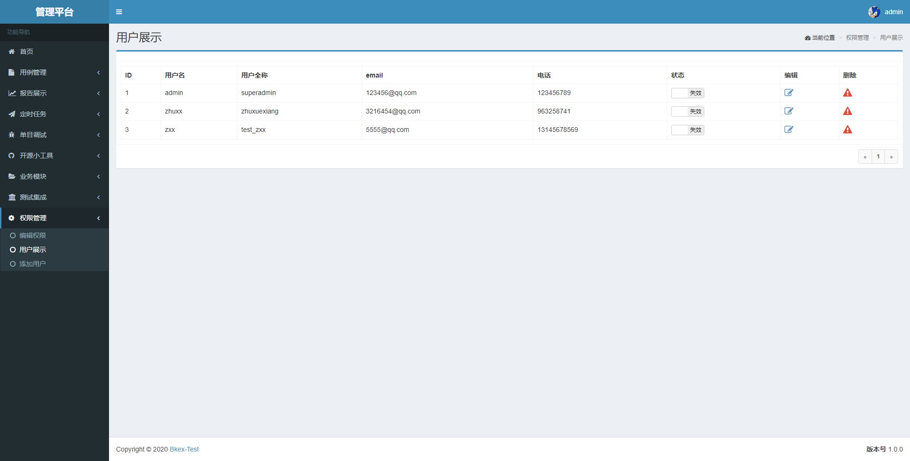
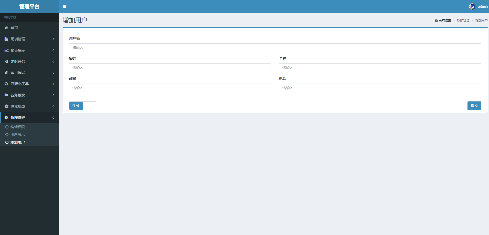
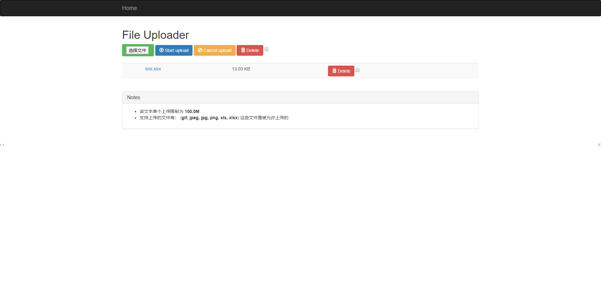
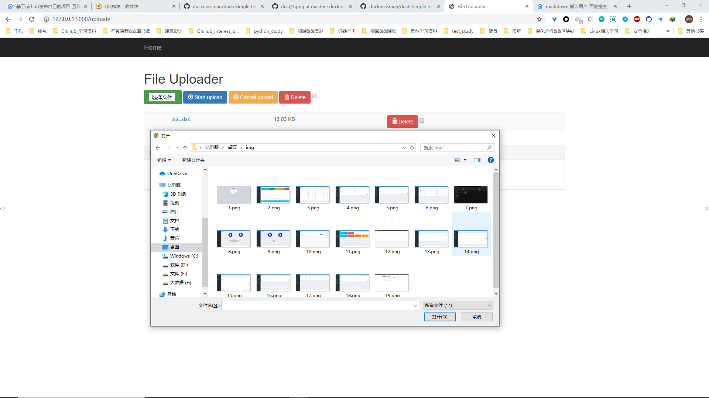

### 安装
#### 1. 安装对应的库
>pip install -r requirements.txt
pip3 install -r requirements.txt

#### 2. 初始化数据库
找到app目录下的models.py 文件，直接运行即可。因为我没有删除我的数据库文件，所以可以直接使用。ps:(但是不建议)

#### 3. 运行程序
创建好数据库之后，就可以直接运行app.py就可以看到上面的截图所示的。

#### 4. 模块系统
模块系统是为各自平台来定制实现，主要是可扩展。

### 后记
因为这个平台是我练手所写的，肯定还存在bug，所以大家见谅，如果有bug,欢迎提bug，或者联系我的qq(2737084408)

ps:(定时任务，集成环境，模块系统和权限系统，暂时还没有写好，写好会上传的)

